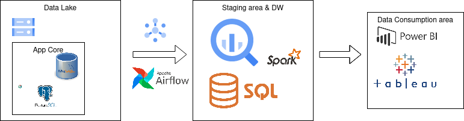

# Data Warehousing Challenge
Design an MVP of a scalable Data Warehouse that responds to the questions ¿What
content are users listening to?, ¿How long does a user listen to content? and explain:
1. How do Data Analysts consume this data?  
2. How can the decision-makers use this data?
3. What are the next steps to implement this DW?
4. How do you monitor this DW?  

The proposed architecture for this DW is defined on the image below:

1. The data analysts can consume this data by the integration with data studio directly from *Big Query* or by creating reports and dashboards using *Power BI* and *tableau* like tools.
2. The decision-makers can access the data through published dashboards on *PowerBi* or *tableau* for specific reports.
3. The first step is define the specific data sources to integrate a data lake after this we can think about how to manage the data transformations and choose the optimal tool for the ETL or ELT process.
4. For monitor it depends on the specific resource, I should use a logger system to integrate all the tools by their logs provided.