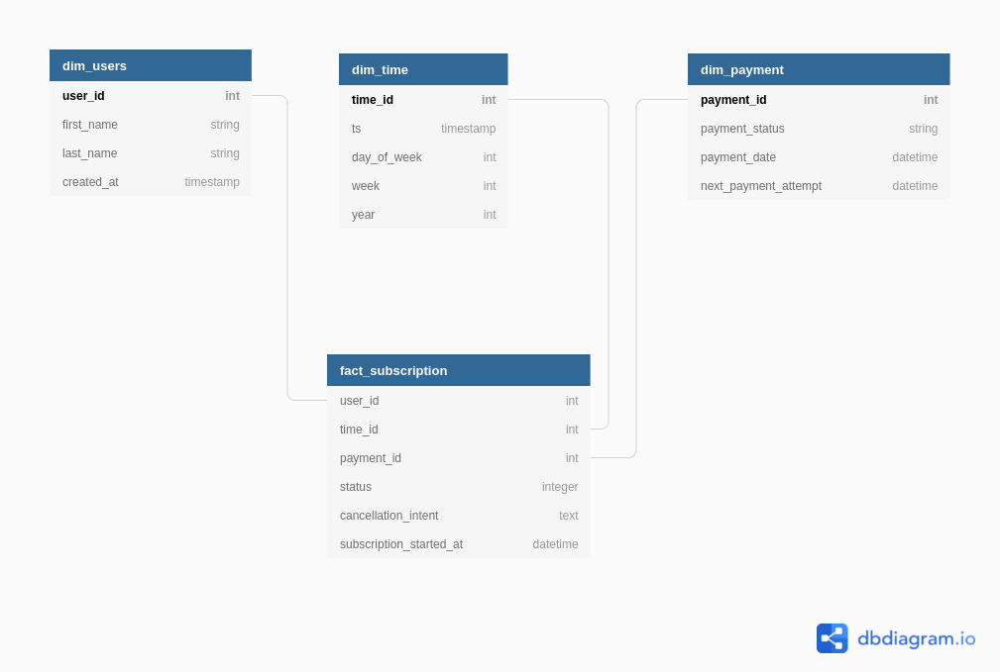

# ETL Challenge
1. Model a table that shows us the data from when a user signs up to when a user pays for a subscription. Think about the business cases and model the data to be consistent with the business.
## User story
* *José Fernando* [user] inicio la versión de prueba de *beek.io* el día 10 de diciembre, 2021 utilizando su tarjeta Visa.  
* *José Fernando* [user] termino la versión de prueba de *beek.io* el día 24 de diciembre, 2021.
* *José Fernando* [user] realizo su primer pago de la suscripción a *beek.io* el día 25 de enero, 2022.
* *José Fernando* [user] intento cancelar su suscripción el día 15 de febrero, 2022.
* *José Fernando* [user] dio de baja su suscripción el día 24 de febrero, 2022.
## Solución propuesta
Para este problema propongo utilizar un modelo dimesional identificando como dimensiones:
* Usuarios
* Tiempo
* Pago   

Y como tabla de hechos será la suscripción como tal. Quedando un diagrama de estrella como el que se muestra en la figura:

2. Build an ETL that takes the information from those tables and makes a CSV file with the resulting table defined above.
* The ETL must run at 06:00 GMT -3.
* In case of failure of the ETL, have to send an email.
* Propose tests that validate the consistency of the data and how they will be implemented.

## Solución propuesta
Para la creación del ETL se utilizará la herramienta *Apache airflow* y se simulará una base de datos **MySQL** para obtener las tablas originales; se creará el *task* para obtener el CSV de la tabla de hechos.  
Se genera un entorno utilizando *Docker compose* en el cuál se genera una instancia de **Apache Airflow** y una base de datos **MySQL**.