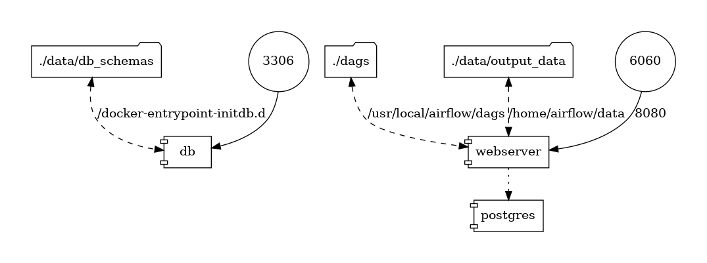

# ETL Challenge
1. Model a table that shows us the data from when a user signs up to when a user pays for a subscription. Think about the business cases and model the data to be consistent with the business.
## User story
* *José Fernando* [user] inicio la versión de prueba de *beek.io* el día 10 de diciembre, 2021 utilizando su tarjeta Visa.  
* *José Fernando* [user] termino la versión de prueba de *beek.io* el día 24 de diciembre, 2021.
* *José Fernando* [user] realizo su primer pago de la suscripción a *beek.io* el día 25 de enero, 2022.
* *José Fernando* [user] intento cancelar su suscripción el día 15 de febrero, 2022.
* *José Fernando* [user] dio de baja su suscripción el día 24 de febrero, 2022.
## Solución propuesta
Para este problema propongo utilizar un modelo dimesional identificando como dimensiones:
* Usuarios
* Tiempo
* Pago   

Y como tabla de hechos será la suscripción como tal. Quedando un diagrama de estrella como el que se muestra en la figura:


2. Build an ETL that takes the information from those tables and makes a CSV file with the resulting table defined above.
* The ETL must run at 06:00 GMT -3.
* In case of failure of the ETL, have to send an email.
* Propose tests that validate the consistency of the data and how they will be implemented.

## Solución propuesta
Para la creación del ETL se utilizará la herramienta *Apache airflow* y se simulará una base de datos **MySQL** para obtener las tablas originales; se creará el *task* para obtener el CSV de la tabla de hechos.  
Se genera un entorno utilizando *Docker compose* en el cuál se genera una instancia de **Apache Airflow** y una base de datos **MySQL**.

1. En la base de datos, se generan 3 tablas con el esquema propuesto y se carga 1 registro.
2. Se establece comunicación entre *airflow* y la base de datos a partir de un conector.
3. Se crea un DAG al cuál se le define la zona horaria de **America/Argentina/Buenos_Aires** que corresponde a **GMT-3**, también se configura para ser ejecutado diariamente a las 6:00 y notificar por correo en caso de fallo (no pude configurar el correo).
```python
tz = pendulum.timezone('America/Argentina/Buenos_Aires')

default_args = {
    'owner': 'jf23perez',
    'depends_on_past': False,
    'email': ['jf23perez@gmail.com'],
    'email_on_failure': False,
    'retries': 1,
    'start_date': datetime(2021, 12, 1, tzinfo=tz)
}

dag = DAG(
    'beek_test_etl',
    default_args=default_args,
    schedule_interval='0 6 * * *',
    catchup=False
)
```
4. Se utiliza un **Hook** de *airflow* para tener una conexión a la base de datos de MySql y se crea un *task* llamado **beek_etl** que ejecuta un query en la BD, lo almacena en un dataframe de pandas y posteriormente lo guarda como un archivo *.csv*.
```python
def get_csv(**kwargs):
    mysqlserver = MySqlHook('mysql_beek')
    sql = """
        SELECT 
            u.id AS user_id, 
            p.id AS payment_id, 
            s.id AS subscription_id,
            u.user_name, 
            s.status, 
            s.cancellation_intent, 
            s.subscription_started_at, 
            p.payment_status, 
            p.payment_date
        FROM
            beek_test.audiobook_subscriptions s
        INNER JOIN
            beek_test.payment p
        ON
            s.payment_id = p.id
        INNER JOIN
            beek_test.users u
        ON
            s.user_id = u.id
    """
    df = mysqlserver.get_pandas_df(sql=sql)
    df.to_csv("/home/airflow/data/outputT.csv", index=False)
    print(df)

beek_etl = PythonOperator(
    dag=dag,
    task_id="get_csv",
    python_callable=get_csv
)

beek_etl
```
A continuación se muestra un gráfico de la arquitectura creada con *docker-compose* para la solución del problema.

